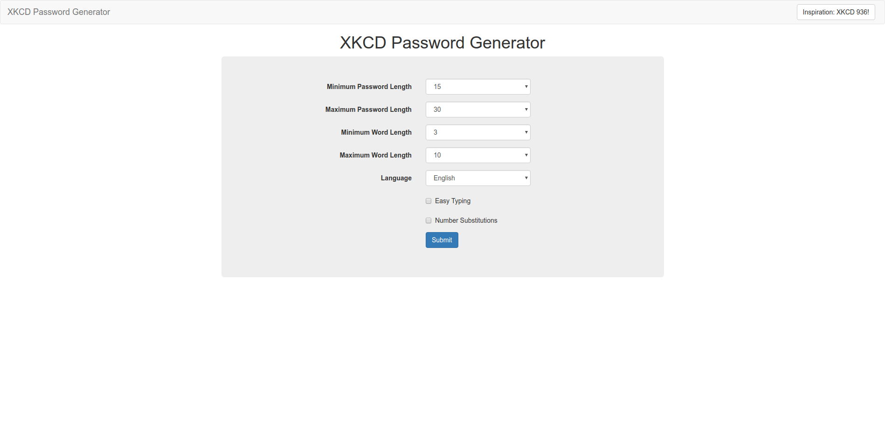
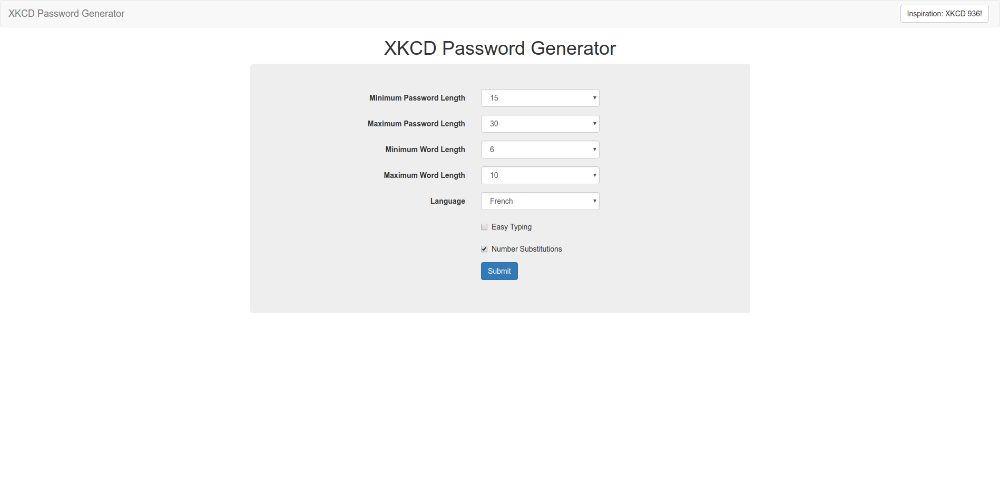
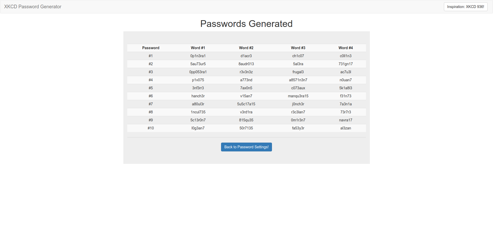
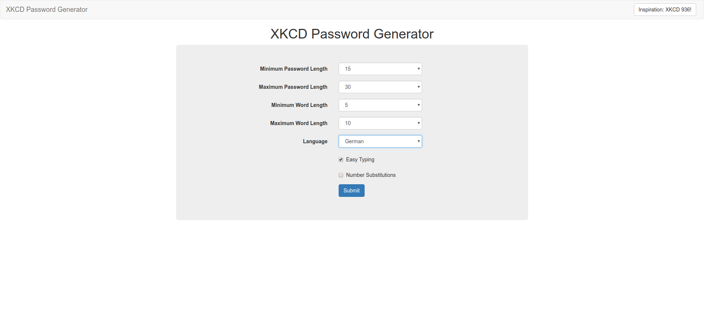
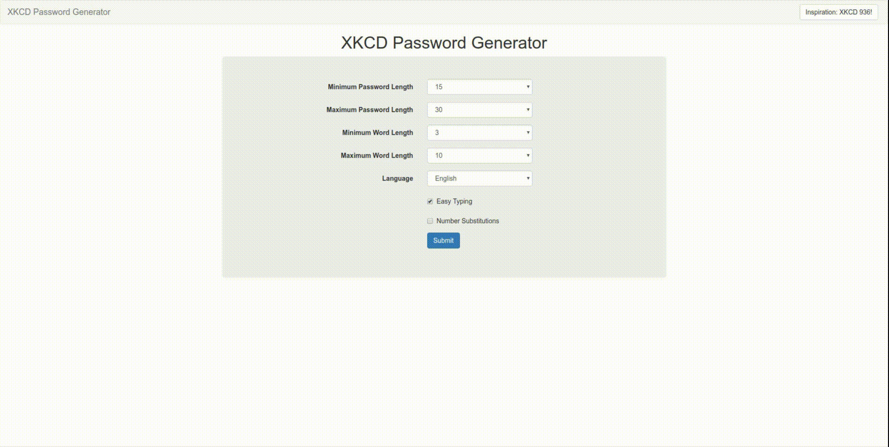

# :1234: XKCD Password Generator :capital_abcd:

[XKCD Password Generator](https://serene-shore-69092.herokuapp.com/) with multilingual support, easy typing, and number substitutions options.

## Table of Content :blue_book:	

   * [<g-emoji class="g-emoji" alias="1234" fallback-src="https://github.githubassets.com/images/icons/emoji/unicode/1f522.png">🔢</g-emoji> XKCD Password Generator <g-emoji class="g-emoji" alias="capital_abcd" fallback-src="https://github.githubassets.com/images/icons/emoji/unicode/1f520.png">🔠</g-emoji>](#1234-xkcd-password-generator-capital_abcd)
      * [Table of Content <g-emoji class="g-emoji" alias="blue_book" fallback-src="https://github.githubassets.com/images/icons/emoji/unicode/1f4d8.png">📘</g-emoji>](#table-of-content-blue_book)
      * [Features <g-emoji class="g-emoji" alias="sparkles" fallback-src="https://github.githubassets.com/images/icons/emoji/unicode/2728.png">✨</g-emoji> <g-emoji class="g-emoji" alias="sunglasses" fallback-src="https://github.githubassets.com/images/icons/emoji/unicode/1f60e.png">😎</g-emoji>](#features-sparkles-sunglasses)
      * [Demo and Screenshots <g-emoji class="g-emoji" alias="camera" fallback-src="https://github.githubassets.com/images/icons/emoji/unicode/1f4f7.png">📷</g-emoji> <g-emoji class="g-emoji" alias="video_camera" fallback-src="https://github.githubassets.com/images/icons/emoji/unicode/1f4f9.png">📹</g-emoji>](#camera-demo-and-screenshots-video_camera)
      * [Usage <g-emoji class="g-emoji" alias="video_game" fallback-src="https://github.githubassets.com/images/icons/emoji/unicode/1f3ae.png">🎮</g-emoji>](#usage-video_game)
        * [Cloning and Virtual Environment](#cloning-and-virtual-environment)
        * [Running the Web App](#running-the-web-app)
      * [Tools <g-emoji class="g-emoji" alias="eyeglasses" fallback-src="https://github.githubassets.com/images/icons/emoji/unicode/1f453.png">👓</g-emoji>](#tools-eyeglasses)
      * [Current Web App Hierarchy <g-emoji class="g-emoji" alias="muscle" fallback-src="https://github.githubassets.com/images/icons/emoji/unicode/1f4aa.png">💪</g-emoji>](#current-web-app-hierarchy-muscle)
      * [Future Plans <g-emoji class="g-emoji" alias="soon" fallback-src="https://github.githubassets.com/images/icons/emoji/unicode/1f51c.png">🔜</g-emoji>](#future-plans-soon)
      * [Contributing <g-emoji class="g-emoji" alias="fire" fallback-src="https://github.githubassets.com/images/icons/emoji/unicode/1f525.png">🔥</g-emoji>](#contributing-fire)
      * [Collaborators & Contributors <g-emoji class="g-emoji" alias="man_dancing" fallback-src="https://github.githubassets.com/images/icons/emoji/unicode/1f57a.png">🕺</g-emoji> <g-emoji class="g-emoji" alias="dancer" fallback-src="https://github.githubassets.com/images/icons/emoji/unicode/1f483.png">💃</g-emoji>](#man_dancing-collaborators--contributors-dancer)
      * [Inspiration <g-emoji class="g-emoji" alias="notebook" fallback-src="https://github.githubassets.com/images/icons/emoji/unicode/1f4d3.png">📓</g-emoji>](#inspiration-notebook)
      * [License <g-emoji class="g-emoji" alias="books" fallback-src="https://github.githubassets.com/images/icons/emoji/unicode/1f4da.png">📚</g-emoji>](#license-books)

## Features :sparkles: :sunglasses:

Currently, XKCD Password Generator supports the following:

* Generating Passwords - 10 Per Request
  * Four Words per Password
* Minimum Password Length
* Maximum Password Length
* Minimum Word Length
* Maximum Word Length
* Eleven Languages

## :camera: Demo and Screenshots :video_camera:

XKCD Password Generator                           | XKCD Password Generator
:-------------------------:|:-------------------------:
   |  
  |  
  |  

## Usage :video_game:

This web app is written in **Python 3.6** using **Flask** Web Framework. Frontend uses **Bootstrap** Framework.

### Cloning and Virtual Environment

Make sure you have **Python 3.6** installed.

* `git clone https://github.com/Ahmad-Magdy-Osman/XKCDPasswordGenerator.git`
* `cd XKCDPasswordGenerator`
* `python3.6 -m venv venv`
* `source venv/bin/active`
* You might want to update pip using `python-3.6 -m pip --upgrade pip`
* Install requirements with `python3.6 -m pip install -r requirements.txt`

### Running the Web App

* Run the Web App using `python3.6 xkcd.py`
* Visit [http://127.0.0.1:5000/](http://127.0.0.1:5000/)

## Tools :eyeglasses:

Programming Languages, Frameworks, Libraries, APIs, Databases, and Data Formats.

* Python 3
  * Flask
    * Flask-WTF
    * Flask-Bootstrap
* HTML & CSS
  * Bootstrap Framework

## Current Web App Hierarchy :muscle:

* Main Page
  * Passwords Generation Options
* Generated Passwords Page
  * Leads back to Main Page
* More to come...

## Future Plans :soon:

Some of the features and functions that would be appropriate for XKCD Password Generator. Please feel free to pick any of them and start working on improving it as a contributor.

* General
  * Mobile Responsiveness
  * Project Structure and Cleaning
* Features
  * User Session
    * Removing Words if Generated Before
  * Regenerate on Generated page
  * Remember User Preferences
* Style/Design
  * Fonts
  * Favico
  * GitHub Corner
  * Divs & Footer
* Marketing
  * SEO
* Read Me
  * Add Collaborates and Contributors

## Contributing :fire:

1. :spaghetti: Fork this repo!
2. Clone and `cd` into it
3. Setup your virtual environment.
4. Create your feature branch: `git checkout -b my-new-feature`
5. Commit your changes: `git commit -m 'Add some feature'`
6. Push to the branch: `git push origin my-new-feature`
7. Submit a pull request :+1:

## :man_dancing: Collaborators & Contributors :dancer:

[ <b>Ahmad M. Osman</b>](https://github.com/Ahmad-Magdy-Osman) 

## Inspiration :notebook:

> **You will fail.**
> 
> You will mess up.
> 
> You'll do poorly on assignments and tests.
> 
> Your side projects will not work.
> 
> Your code will be sloppy and incomplete.
> 
> You will bomb job interviews.
> 
> Your PR's will be rejected.
> 
> And because you fail, you will succeed.
> 
> Don't be afraid to fail, don't let it destroy your self-confidence, don't let it define you. Instead, do everything you can to learn from that failure and take that new knowledge into the next piece of work.
> 
> Indeed, failure is the only path to success.

        ― Stranger on the Internet.

## License :books:

XKCD Password Generator is an open source project under MIT license.
